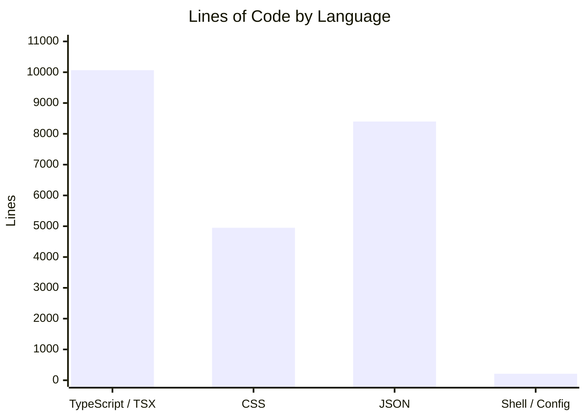

# By the Numbers

Data collected on June 17, 2026.

## Language Breakdown

> **Note**: JSON figure estimated from ~840KB across 154 question data files in `public/questions/`. Shell / Config includes scripts in `scripts/`, `.github/workflows/*.yml`, root-level config (`package.json`, `tsconfig.json`, `eslint.config.js`, `wrangler.jsonc`).

## Source Files

| Category                            | Count   |
| ----------------------------------- | ------- |
| Source files (`src/`)               | 103     |
| Test files                          | 19      |
| Config files (root level)           | 10      |
| Scripts (`scripts/`)                | 3       |
| Cloudflare Functions (`functions/`) | 1       |
| **Total**                           | **136** |

### Source Breakdown (`src/`)

| Directory         | Purpose                                | Approx. count |
| ----------------- | -------------------------------------- | ------------- |
| `src/pages/`      | Page components per task type          | ~30           |
| `src/components/` | Shared UI, layout, question components | ~20           |
| `src/hooks/`      | Custom React hooks                     | 7             |
| `src/lib/`        | Pure utility modules                   | 8             |
| `src/styles/`     | CSS variables, global styles           | 4             |
| `src/store/`      | Zustand store (currently empty)        | —             |

### Test Files

| File                                                    | What it tests                         |
| ------------------------------------------------------- | ------------------------------------- |
| `src/lib/questions.test.ts`                             | Question loading and count extraction |
| `src/lib/time.test.ts`                                  | Time formatting utilities             |
| `src/lib/answerSubmission.test.ts`                      | Answer persistence logic              |
| `src/lib/toefl-reading-daily-life.test.ts`              | Daily-life reading parsing            |
| `src/lib/voiceMapping.test.ts`                          | Voice assignment logic                |
| `src/hooks/useQuestion.test.ts`                         | Question fetching hook                |
| `src/hooks/useTimer.test.ts`                            | Timer hook                            |
| `src/hooks/useElapsedTimer.test.ts`                     | Elapsed timer hook                    |
| `src/hooks/useScoreHistory.test.ts`                     | Score history hook                    |
| `src/hooks/useTts.test.tsx`                             | TTS playback hook                     |
| `src/hooks/useSpeechRecognition.test.ts`                | Speech recognition hook               |
| `src/components/question/QuestionSelectorPage.test.tsx` | Question selector UI                  |
| `src/components/layout/layout-components.test.tsx`      | Layout components                     |
| `src/components/ui/ui-components.test.tsx`              | UI components                         |
| `src/pages/toefl/reading/CompleteWordsPage.test.ts`     | Complete Words task                   |
| `src/pages/toefl/listening/ListeningTaskPage.test.tsx`  | Listening task UI                     |
| `src/pages/toefl/speaking/ListenRepeatPage.test.ts`     | Listen & Repeat logic                 |
| `src/pages/toefl/speaking/ListenRepeatPage.test.tsx`    | Listen & Repeat UI                    |
| `src/pages/toeic/ListeningWrappers.test.tsx`            | TOEIC listening wrappers              |

## Dependencies

| Package                  | Version  | Role                                  |
| ------------------------ | -------- | ------------------------------------- |
| `react`                  | ^19.2.0  | UI library                            |
| `react-dom`              | ^19.2.0  | DOM renderer                          |
| `react-router-dom`       | ^7.13.0  | Client-side routing                   |
| `zustand`                | ^5.0.11  | State management                      |
| `vite`                   | ^7.3.1   | Build tool / dev server               |
| `vitest`                 | ^3.2.4   | Test runner                           |
| `wrangler`               | ^4.100.0 | Cloudflare Pages / Workers deployment |
| `typescript`             | ~5.9.3   | Language                              |
| `jsdom`                  | ^27.2.0  | DOM environment for tests             |
| `@testing-library/react` | ^16.3.0  | React component testing               |

## Activity

| Metric             | Value      |
| ------------------ | ---------- |
| Total commits      | 77         |
| Contributors       | 2          |
| First commit       | 2026-02-18 |
| Most recent commit | 2026-06-13 |
