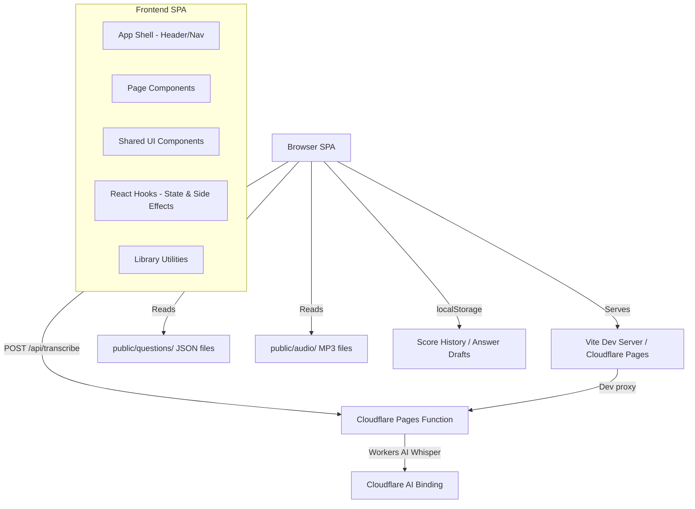
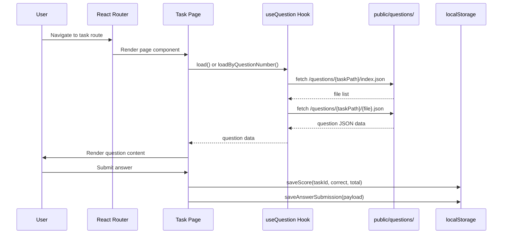
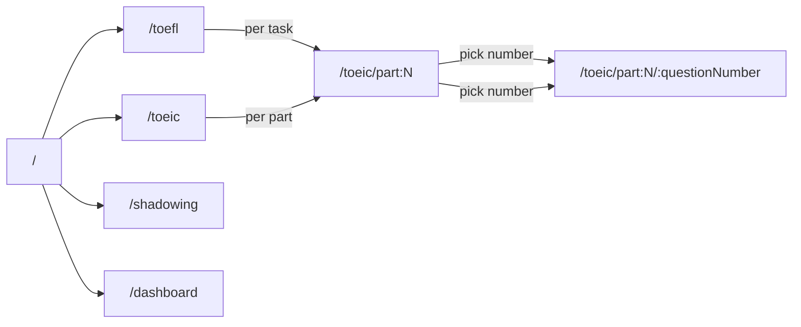

# Architecture

The application follows a single-page application (SPA) architecture built with React and served via Vite. Question data is loaded from static JSON files at runtime, and cloud infrastructure is minimal — only a Cloudflare Pages Function for speech transcription.

## Component architecture

The frontend is organized into four layers:

- **Pages** (`src/pages/`) — top-level route components for each TOEFL task, TOEIC part, home page, dashboard, and shadowing practice
- **Components** (`src/components/`) — reusable UI building blocks: layout shell, question selector, buttons, feedback panels, progress bars, timers, speed controls, and the listening task base
- **Hooks** (`src/hooks/`) — React hooks encapsulating shared state and side effects: question loading, score history, timers, TTS, speech recognition, and elapsed time tracking
- **Lib** (`src/lib/`) — pure utility functions: question fetching, answer persistence, time formatting, voice mapping, audio transcription API

## Data flow

## Routing

The app uses `HashRouter` with routes defined in `src/App.tsx`. Each task has a two-level route: a question selector (`/task/path`) and an individual question page (`/task/path/:questionNumber`).

## Storage

All persistent data uses the browser's `localStorage`:

- **Score history** — `score-history` key stores per-attempt correctness, timing, and task IDs
- **Answer history** — `answer-history` key stores writing responses for grading
- **Draft answers** — `answer-draft:*` keys store in-progress writing answers

## Cloud infrastructure

- **Cloudflare Pages** — hosts the built SPA at the edge
- **Workers AI binding** (`@cf/openai/whisper`) — transcribes audio recordings for the Listen and Repeat task
- **Wrangler** — CLI for local development and deployment

Key source files:

| File                           | Purpose                                        |
| ------------------------------ | ---------------------------------------------- |
| `src/App.tsx`                  | Route definitions and app shell wiring         |
| `src/main.tsx`                 | Application entry point                        |
| `vite.config.ts`               | Vite configuration with API proxy              |
| `wrangler.jsonc`               | Cloudflare Pages configuration with AI binding |
| `.github/workflows/deploy.yml` | CI/CD deployment to Cloudflare Pages           |
