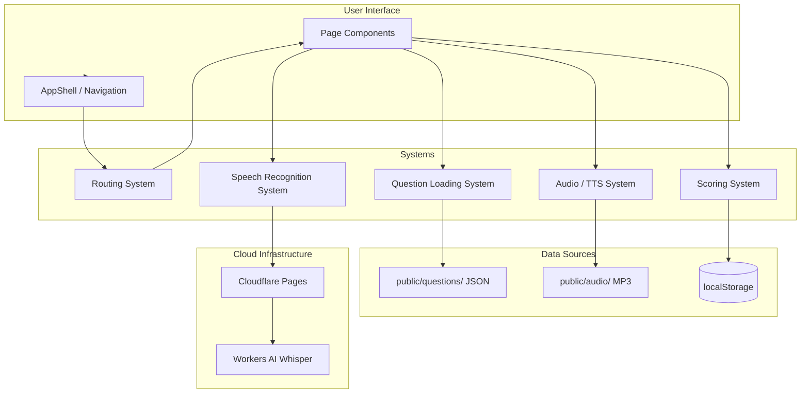

# Systems Overview

The app is a single-page application with six major systems that handle data loading, audio, speech, persistence, and navigation. All except speech transcription run entirely in the browser without network calls.

## System map

## System responsibilities

| System                                   | Purpose                                                           | Key files                                                                                   | Network dependency         |
| ---------------------------------------- | ----------------------------------------------------------------- | ------------------------------------------------------------------------------------------- | -------------------------- |
| [Routing](routing)                       | Declarative route definitions and app shell navigation            | `src/App.tsx`, `src/components/layout/AppShell.tsx`                                         | None                       |
| [Question Loading](question-loading)     | Fetch and parse pre-generated JSON question files                 | `src/lib/questions.ts`, `src/hooks/useQuestion.ts`                                          | None (static files)        |
| [Audio / TTS](audio-tts)                 | Browser-based audio playback with concatenation and speed control | `src/hooks/useTts.ts`, `src/lib/voiceMapping.ts`, `scripts/generate-audio.ts`               | TTS generation script only |
| [Speech Recognition](speech-recognition) | Browser MediaRecorder recording + Whisper transcription           | `src/hooks/useSpeechRecognition.ts`, `src/lib/transcribe.ts`, `functions/api/transcribe.ts` | Cloudflare Workers AI      |
| [Scoring](scoring)                       | Score history, answer persistence, and draft management           | `src/hooks/useScoreHistory.ts`, `src/lib/answerSubmission.ts`                               | None (localStorage)        |

## Integration summary

- **Question Loading** feeds question data into every task page. Task pages call `useQuestion(taskPath)` to load random or specific questions.
- **Audio / TTS** is used by listening tasks (Conversation, Lecture, Announcement, Response), speaking tasks (Listen and Repeat, Interview), TOEIC Parts 2-4, and the Shadowing feature.
- **Speech Recognition** is used exclusively by the Listen and Repeat speaking task.
- **Scoring** is used by all task pages to record correctness and by the Dashboard to display performance data.
- **Routing** wires all pages together. Each task has a two-level route: a selector page and an individual question page.

## Entry points for modification

- To add a new task type: add a route entry in `src/App.tsx`, a page component, and update the `TaskId` type in `src/hooks/useScoreHistory.ts`.
- To change question file format: update `src/lib/questions.ts` and the task page that renders the data.
- To add a new audio source: extend `src/hooks/useTts.ts` with a new `play*` method.
- To change transcription provider: modify `functions/api/transcribe.ts` and `src/lib/transcribe.ts`.

Key source files:

| File                                 | Purpose                                                       |
| ------------------------------------ | ------------------------------------------------------------- |
| `src/lib/questions.ts`               | Question file fetching and parsing utilities                  |
| `src/hooks/useQuestion.ts`           | React hook wrapping question loading with state management    |
| `src/hooks/useTts.ts`                | Audio playback with AudioContext concatenation, speed control |
| `src/lib/voiceMapping.ts`            | Role-to-TTS-voice mapping                                     |
| `src/hooks/useSpeechRecognition.ts`  | Browser recording + Whisper transcription hook                |
| `src/lib/transcribe.ts`              | API client for the transcription endpoint                     |
| `functions/api/transcribe.ts`        | Cloudflare Pages Function using Workers AI Whisper            |
| `src/hooks/useScoreHistory.ts`       | Score persistence and retrieval via localStorage              |
| `src/lib/answerSubmission.ts`        | Answer draft and submission management                        |
| `src/App.tsx`                        | All route definitions                                         |
| `src/components/layout/AppShell.tsx` | App shell with header navigation                              |
| `scripts/generate-audio.ts`          | External TTS audio generation script                          |
