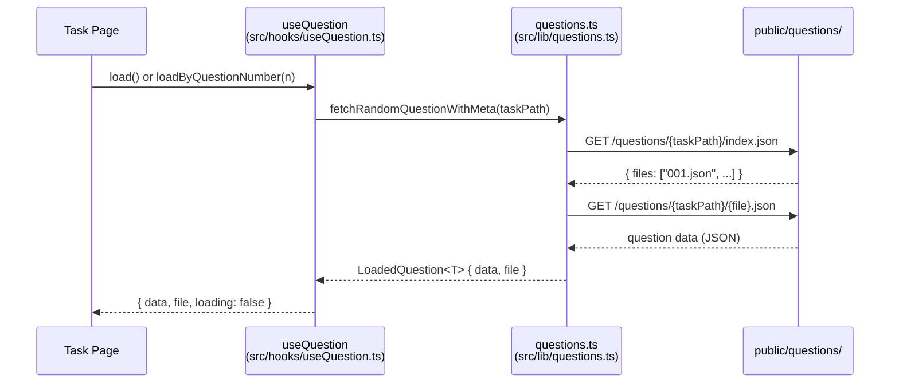

# Question Loading System

Loads pre-generated AI question JSON files from the `public/questions/` directory at runtime. Questions are generated offline by AI agents and committed to the repo; no network or API calls are made during loading.

## Directory layout

```
public/questions/
├── toefl/
│   ├── reading/
│   │   ├── complete-words/   001.json, 002.json, ..., index.json
│   │   ├── daily-life/       001.json, 002.json, ..., index.json
│   │   └── academic/         001.json, 002.json, ..., index.json
│   ├── listening/
│   │   ├── conversation/     001.json, 002.json, ..., index.json
│   │   ├── lecture/          001.json, 002.json, ..., index.json
│   │   ├── response/         001.json, 002.json, ..., index.json
│   │   └── announcement/     001.json, 002.json, ..., index.json
│   ├── writing/
│   │   ├── build-sentence/   001.json, 002.json, ..., index.json
│   │   ├── email/            001.json, 002.json, ..., index.json
│   │   └── discussion/       001.json, 002.json, ..., index.json
│   └── speaking/
│       ├── listen-repeat/    001.json, 002.json, ..., index.json
│       └── interview/        001.json, 002.json, ..., index.json
├── toeic/
│   ├── part2/                001.json, 002.json, ..., index.json
│   ├── part3/                001.json, 002.json, ..., index.json
│   ├── part4/                001.json, 002.json, ..., index.json
│   ├── part5/                001.json, 002.json, ..., index.json
│   ├── part6/                001.json, 002.json, ..., index.json
│   └── part7/                001.json, 002.json, ..., index.json
└── shadowing/
    ├── 001.json, 002.json, ..., index.json
```

Each task directory contains an `index.json` that lists available files:

```json
{ "files": ["001.json", "002.json"] }
```

Every `.json` file in these directories (except `index.json`) is a complete question set for that task type.

## Key abstractions

**Types** (`src/lib/questions.ts`):

| Type                | Description                                                       |
| ------------------- | ----------------------------------------------------------------- |
| `QuestionIndex`     | `{ files: string[] }` — index file contents                       |
| `LoadedQuestion<T>` | `{ data: T; file: string }` — wraps parsed data with its filename |
| `QuestionFileEntry` | `{ file: string; number: number }` — numeric file info            |

**Functions** (`src/lib/questions.ts`):

| Function                                         | Returns                        | Description                         |
| ------------------------------------------------ | ------------------------------ | ----------------------------------- |
| `fetchQuestionIndex(taskPath)`                   | `Promise<QuestionIndex>`       | Fetches `index.json` for a task     |
| `listQuestionFiles(taskPath)`                    | `Promise<QuestionFileEntry[]>` | Lists files sorted numerically      |
| `fetchRandomQuestionWithMeta<T>(taskPath)`       | `Promise<LoadedQuestion<T>>`   | Picks a random file and loads it    |
| `fetchRandomQuestion<T>(taskPath)`               | `Promise<T>`                   | Same but only returns data          |
| `fetchQuestionByNumberWithMeta<T>(taskPath, n)`  | `Promise<LoadedQuestion<T>>`   | Loads a specific numbered file      |
| `fetchQuestionByFileWithMeta<T>(taskPath, file)` | `Promise<LoadedQuestion<T>>`   | Loads a specific file by name       |
| `fetchAllQuestions<T>(taskPath)`                 | `Promise<T[]>`                 | Loads all question files for a task |

**Hook** (`src/hooks/useQuestion.ts`):

| Property                  | Type                           | Description          |
| ------------------------- | ------------------------------ | -------------------- |
| `data`                    | `T \| null`                    | Parsed question data |
| `file`                    | `string \| null`               | Loaded filename      |
| `loading`                 | `boolean`                      | True while fetching  |
| `error`                   | `string \| null`               | Error message if any |
| `load()`                  | `() => Promise<void>`          | Load random question |
| `loadByFile(file)`        | `(f: string) => Promise<void>` | Load by filename     |
| `loadByQuestionNumber(n)` | `(n: number) => Promise<void>` | Load by number       |

## How it works



1. A task page calls `load()` or `loadByQuestionNumber(n)` on the `useQuestion` hook.
2. The hook delegates to the corresponding function in `src/lib/questions.ts`.
3. The lib function fetches `index.json` to discover available files.
4. File discovery is validated: filenames must be numeric (e.g., `001.json`) or an error is thrown.
5. The selected question JSON is fetched and parsed.
6. The hook sets `data`, `file`, `loading`, or `error` state, which the page component renders.

## Integration points

- Every task page (TOEFL Reading/Writing/Speaking/Listening tasks, TOEIC Parts 2-7, Shadowing) uses `useQuestion(taskPath)` to load questions.
- The `QuestionSelectorPage` component lists available questions by calling `listQuestionFiles` and showing score metadata per number.
- Question files with `audioSegments` fields also drive [audio generation](audio-tts) and playback.

## Entry points for modification

- **Add a new task path**: add the path to `src/hooks/useScoreHistory.ts` `TaskId` type and create `public/questions/<new-path>/`.
- **Change file format**: update the parsing logic in `src/lib/questions.ts` and the corresponding page component.
- **Add loading strategy**: extend `useQuestion` with new load methods (e.g., `loadNext`/`loadPrevious`).

Key source files:

| File                           | Purpose                                                       |
| ------------------------------ | ------------------------------------------------------------- |
| `src/lib/questions.ts`         | All question fetching and file discovery logic                |
| `src/hooks/useQuestion.ts`     | React hook wrapping question loading with loading/error state |
| `src/hooks/useScoreHistory.ts` | `TaskId` type shared with question paths                      |
