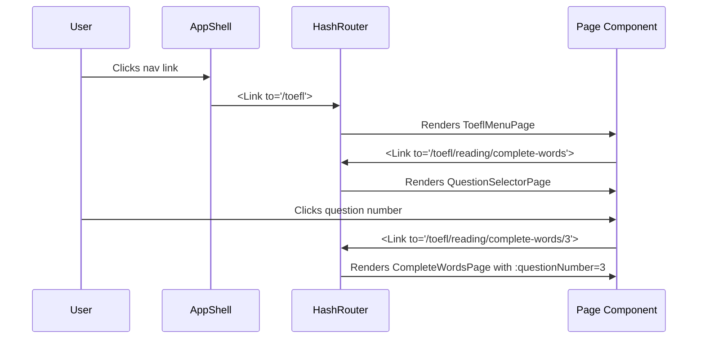

# Routing System

Uses `HashRouter` from `react-router-dom` v7 with all routes defined declaratively in `src/App.tsx`. Navigation is provided by the `AppShell` header component with pill-shaped links and keyboard shortcut support.

## Route structure

```mermaid
graph TD
    Home["/"] --> Dashboard["/dashboard"]
    Home --> TOEFL["/toefl"]
    Home --> TOEIC["/toeic"]
    Home --> Shadowing["/shadowing"]

    TOEFL --> CW["/toefl/reading/complete-words"]
    TOEFL --> DL["/toefl/reading/daily-life"]
    TOEFL --> AP["/toefl/reading/academic"]
    TOEFL --> BS["/toefl/writing/build-sentence"]
    TOEFL --> EM["/toefl/writing/email"]
    TOEFL --> WD["/toefl/writing/discussion"]
    TOEFL --> LR["/toefl/speaking/listen-repeat"]
    TOEFL --> TI["/toefl/speaking/interview"]
    TOEFL --> CONV["/toefl/listening/conversation"]
    TOEFL --> LEC["/toefl/listening/lecture"]
    TOEFL --> RES["/toefl/listening/response"]
    TOEFL --> ANN["/toefl/listening/announcement"]

    TOEIC --> P2["/toeic/part2"]
    TOEIC --> P3["/toeic/part3"]
    TOEIC --> P4["/toeic/part4"]
    TOEIC --> P5["/toeic/part5"]
    TOEIC --> P6["/toeic/part6"]
    TOEIC --> P7["/toeic/part7"]

    subgraph Two-level[Two-level task routes]
        direction LR
        Task["/:taskPath"] --> Question["/:taskPath/:questionNumber"]
    end

    CW -.-> Two-level
    P2 -.-> Two-level
```



## Route definitions

### Top-level pages

| Path         | Component              | Description                                              |
| ------------ | ---------------------- | -------------------------------------------------------- |
| `/`          | `HomePage`             | Hero, TOEFL/TOEIC product cards, stats teaser            |
| `/dashboard` | `DashboardPage`        | KPIs, per-task charts, recent attempts                   |
| `/toefl`     | `ToeflMenuPage`        | TOEFL section cards (Reading/Writing/Speaking/Listening) |
| `/toeic`     | `ToeicMenuPage`        | TOEIC part cards (Parts 2-7)                             |
| `/shadowing` | `QuestionSelectorPage` | Shadowing practice selector + page                       |

### Task routes (two-level)

Each of the 18 task types gets two routes:

1. **Selector**: `/{taskPath}` renders `QuestionSelectorPage` with a numbered grid of available questions.
2. **Question**: `/{taskPath}/:questionNumber` renders the specific task page component.

Task routes are defined programmatically via the `taskRoutes` array in `src/App.tsx`:

```typescript
interface TaskRoute {
  basePath: string; // e.g., "/toefl/reading/complete-words"
  taskId: TaskId; // e.g., "toefl/reading/complete-words"
  title: string; // Display title
  subtitle: string; // Display subtitle
  backTo: string; // Parent route for back link
  page: ReactElement; // Task page component
}
```

18 task routes are configured:

- **TOEFL Reading** (3): complete-words, daily-life, academic
- **TOEFL Writing** (3): build-sentence, email, discussion
- **TOEFL Speaking** (2): listen-repeat, interview
- **TOEFL Listening** (4): conversation, lecture, response, announcement
- **TOEIC** (6): part2 through part7
- **Other** (1): shadowing

## App shell and navigation

`AppShell` (`src/components/layout/AppShell.tsx`) wraps all routes with a sticky header:

```
[ET] English Test Practice    [TOEFL 2026] [TOEIC L&R] | [Shadowing] | [Dashboard]  ⌘D
```

- **Logo**: "ET" mark + "English Test Practice" wordmark, links to `/`.
- **Nav links**: pill-shaped links for TOEFL 2026, TOEIC L&R, Shadowing, and Dashboard.
- **Active state**: the current section's nav link gets filled accent pill styling.
- **Keyboard shortcut**: `⌘D` / `Ctrl+D` navigates to Dashboard.
- **Back links**: task page headers include a back arrow linking to `backTo` (e.g., `/toefl`).

## How routing works



1. User clicks a navigation link in `AppShell` or a route link within a page.
2. `HashRouter` updates the URL hash and matches against the `Routes` tree.
3. The matched component renders.
4. For task routes, the `:questionNumber` param is read via `useParams()` in the page component, which calls `loadByQuestionNumber(Number(params.questionNumber))`.

## Integration points

- **All pages** are wired through this routing system.
- **QuestionSelectorPage** receives `taskId`, `title`, `subtitle`, `backTo`, and `basePath` as props from the route definition.
- **Task page components** read `:questionNumber` from URL params to load specific questions.
- **AppShell** uses `useLocation()` to determine active nav state and `useNavigate()` for keyboard shortcuts.

## Entry points for modification

- **Add a new top-level page**: add a `<Route path="...">` to the `Routes` block and wire a nav link in `AppShell`.
- **Add a new task type**: add an entry to the `taskRoutes` array in `src/App.tsx`, specifying its path, task ID, title, and page component. Also add the path to the `TaskId` type in `src/hooks/useScoreHistory.ts`.
- **Change navigation layout**: modify `AppShell` header structure and CSS.
- **Add keyboard shortcuts**: add more `useEffect` handlers in `AppShell`.

Key source files:

| File                                               | Purpose                                                 |
| -------------------------------------------------- | ------------------------------------------------------- |
| `src/App.tsx`                                      | All route definitions and task route configuration      |
| `src/components/layout/AppShell.tsx`               | App shell with header navigation and keyboard shortcuts |
| `src/components/question/QuestionSelectorPage.tsx` | Question grid rendered at each task's base path         |
| `src/pages/toefl/ToeflMenuPage.tsx`                | TOEFL section menu                                      |
| `src/pages/toeic/ToeicMenuPage.tsx`                | TOEIC part menu                                         |
| `src/pages/HomePage.tsx`                           | Landing page with hero and product cards                |
| `src/pages/DashboardPage.tsx`                      | Performance overview                                    |
