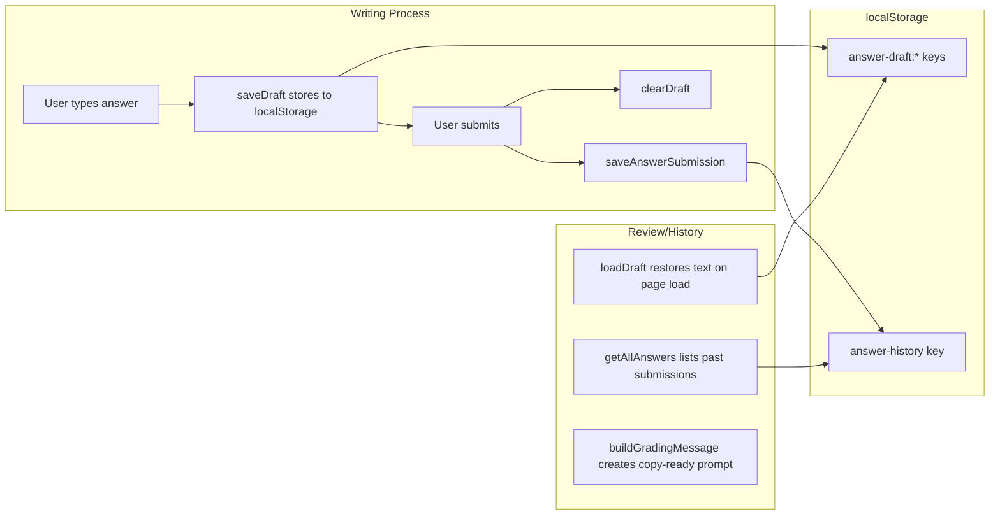

# Scoring System

Tracks user performance and answer data entirely in `localStorage`. Two subsystems: **score history** (correct/incorrect counts per attempt) and **answer persistence** (writing submissions and draft recovery).

## Data storage

All data uses `localStorage` with string-keyed entries:

| Key                        | Format          | Purpose                                  |
| -------------------------- | --------------- | ---------------------------------------- |
| `score-history`            | `ScoreEntry[]`  | Per-attempt correctness, timing, task ID |
| `answer-history`           | `AnswerEntry[]` | Writing answer submissions               |
| `answer-draft:{problemId}` | string          | In-progress draft text for writing tasks |

## Subsystem 1: Score history (`useScoreHistory`)

### Types

| Type         | Fields                                                                                                  | Description                     |
| ------------ | ------------------------------------------------------------------------------------------------------- | ------------------------------- |
| `TaskId`     | Union of all task path strings (e.g., `"toefl/reading/complete-words"`, `"toeic/part5"`, `"shadowing"`) | Identifies a specific task type |
| `ScoreEntry` | `{ taskId, date, correct, total, pct, elapsedSeconds?, questionFile? }`                                 | A single attempt record         |

### Hook API

| Method      | Signature                                                                   | Description         |
| ----------- | --------------------------------------------------------------------------- | ------------------- |
| `saveScore` | `(taskId, correct, total, elapsedSeconds?, questionFile?) => Promise<void>` | Record an attempt   |
| `getAll`    | `() => Promise<ScoreEntry[]>`                                               | Retrieve all scores |
| `clearAll`  | `() => Promise<void>`                                                       | Delete all scores   |

### How it works

1. When a user completes a task, the page calls `saveScore(taskId, correct, total, elapsedSeconds, questionFile)`.
2. A `ScoreEntry` is created with an ISO date string, the computed percentage (`Math.round((correct / total) * 100)`), and optional timing/file metadata.
3. The entry is appended to the existing array from `localStorage`.
4. The Dashboard reads all entries via `getAll()` to compute KPIs and per-task statistics.

## Subsystem 2: Answer persistence (`answerSubmission`)

### Types

| Type                | Fields                                            | Description            |
| ------------------- | ------------------------------------------------- | ---------------------- |
| `SaveAnswerPayload` | `{ taskId, problemId, response, question? }`      | Input for saving       |
| `AnswerEntry`       | `{ answerId, taskId, problemId, response, date }` | A stored answer record |

### Functions

| Function                                             | Description                                                             |
| ---------------------------------------------------- | ----------------------------------------------------------------------- |
| `buildProblemId(taskId, sourceFile, subQuestionId?)` | Creates a unique problem identifier like `"toefl/writing/email/001#q1"` |
| `saveAnswerSubmission(payload)`                      | Saves a submitted answer to `answer-history`                            |
| `getAllAnswers()`                                    | Returns all answers in reverse chronological order                      |
| `buildGradingMessage(problemId, answerId)`           | Generates a copy-ready grading prompt for AI                            |
| `saveDraft(problemId, text)`                         | Persists in-progress writing to `answer-draft:{id}`                     |
| `loadDraft(problemId)`                               | Retrieves saved draft, empty string if none                             |
| `clearDraft(problemId)`                              | Removes draft after submission                                          |
| `copyText(text)`                                     | Copies text to clipboard (used for grading message)                     |

### How it works

1. **Drafting**: As the user types a writing answer, it is debounce-saved to `answer-draft:{problemId}`. On task revisit, `loadDraft` restores the text.
2. **Submission**: On submit, `saveAnswerSubmission` generates a unique `answerId` (timestamp-based), creates an `AnswerEntry`, and appends it to `answer-history`. The draft is then cleared.
3. **Grading**: `buildGradingMessage` creates a prompt string like `"I completed problem toefl/writing/email/001. My answer ID is ans-1712345678. Please grade it."` which the user can copy via `copyText` to an AI chat.
4. **Review**: `getAllAnswers` returns all submissions sorted newest-first for display in the Dashboard or a history view.

## Integration points

- **All task pages** call `saveScore` on completion to record results.
- **Writing task pages** (Build Sentence, Write Email, Write Discussion) use `saveDraft`/`loadDraft`/`saveAnswerSubmission`/`buildGradingMessage`.
- **Dashboard** calls `getAll()` and `getAllAnswers()` to render KPIs, per-task charts, and attempt lists.
- **Question Selector** reads score history to display per-question accuracy pills.

## Entry points for modification

- **Add new metric**: add a field to `ScoreEntry` and update `saveScore` callsites and Dashboard rendering.
- **Change storage backend**: swap `localStorage` calls for IndexedDB, a remote API, or any storage adapter. The hook and lib functions return `Promise` already, making this straightforward.
- **Add answer grading**: extend `AnswerEntry` with a `grade` field and create a grading endpoint.
- **Change draft debounce strategy**: update the save interval in the writing page components that call `saveDraft`.

Key source files:

| File                           | Purpose                                         |
| ------------------------------ | ----------------------------------------------- |
| `src/hooks/useScoreHistory.ts` | Score entry CRUD with localStorage              |
| `src/lib/answerSubmission.ts`  | Answer draft, submission, and grading utilities |
