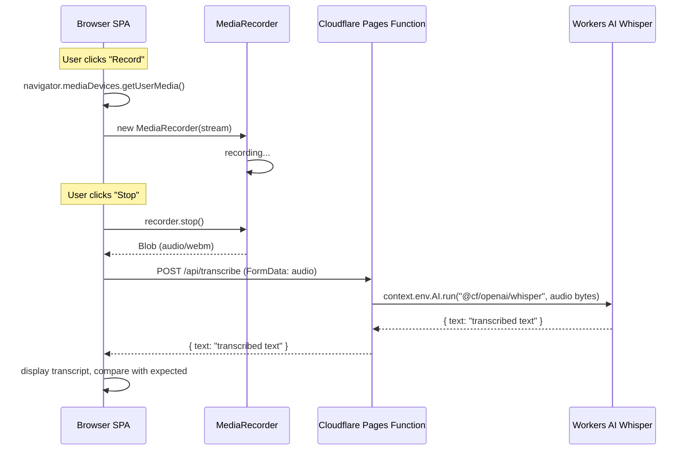

# Speech Recognition System

Records audio from the browser microphone using `MediaRecorder`, then sends it to a Cloudflare Pages Function backed by Workers AI (Whisper) for transcription. Used exclusively by the **Listen and Repeat** speaking task.

## Architecture



## Key abstractions

**Hook** (`src/hooks/useSpeechRecognition.ts`):

| Property/Method | Description                                                      |
| --------------- | ---------------------------------------------------------------- |
| `supported`     | Boolean — browser has `MediaRecorder` + `getUserMedia`           |
| `recording`     | Boolean — true while microphone is active                        |
| `transcript`    | String — latest transcription result                             |
| `error`         | String or null — error message                                   |
| `start()`       | Request mic access and begin recording                           |
| `stop()`        | Stop recording, return promise that resolves after transcription |

**API client** (`src/lib/transcribe.ts`):

| Function                              | Description                                                        |
| ------------------------------------- | ------------------------------------------------------------------ |
| `transcribeAudio(blob, url, signal?)` | POST audio Blob to transcription endpoint, return transcribed text |

**Cloudflare Pages Function** (`functions/api/transcribe.ts`):

| Handler            | Description                                                                                                                         |
| ------------------ | ----------------------------------------------------------------------------------------------------------------------------------- |
| `onRequestPost`    | Parses multipart form data, validates audio size (max 25 MB), sends to Workers AI Whisper with `language: "en"`, returns `{ text }` |
| `onRequestOptions` | Returns CORS preflight headers                                                                                                      |

## How it works

### Browser recording

1. Browser support is checked: `navigator.mediaDevices.getUserMedia` and `MediaRecorder` must exist.
2. A suitable MIME type is selected from candidates: `audio/webm;codecs=opus`, `audio/webm`, `audio/mp4`, `audio/mp4;codecs=mp4a.40.2`.
3. `getUserMedia({ audio: true })` opens the microphone stream.
4. A `MediaRecorder` instance captures chunks via `dataavailable` events.
5. On `stop`, all chunks are assembled into a single `Blob` with the selected MIME type.
6. The blob is sent to the transcription endpoint; an `AbortController` allows cancellation.

### Transcription API

1. The `POST /api/transcribe` endpoint receives a `FormData` body with an `audio` field.
2. Content-Length is checked against a 25 MB limit.
3. Audio bytes are converted to a `Uint8Array` and sent to `@cf/openai/whisper` with `language: "en"`.
4. The transcribed `text` is returned as JSON: `{ text: "..." }`.
5. CORS headers are set on all responses for cross-origin development.

### Error handling

- Microphone permission denied, device not found, or generic `DOMException` produce user-facing messages.
- Transcription failures (network error, API error) surface as `"Transcription failed. Please try again."`.
- Empty audio recordings produce `"No audio recorded. Please try again."`.
- The `AbortController` prevents stale transcription callbacks if recording is stopped and restarted rapidly.

## Data flow

```
User clicks Record
  → start() called
    → getUserMedia() → stream
    → new MediaRecorder(stream) → recording
User clicks Stop
  → stop() called
    → recorder.stop()
    → chunks assembled into Blob
    → transcribeAudio(blob, "/api/transcribe")
      → POST /api/transcribe (FormData)
        → Workers AI Whisper
      → response { text }
    → transcript state updated
```

## Integration points

- **Listen and Repeat task** (`src/pages/toefl/speaking/ListenRepeatPage.tsx`) — plays a sentence via TTS, then records the user's repetition, transcribes it, and compares against the expected text for accuracy feedback.
- The hook is standalone and could be used by other speaking tasks if needed.

## Configuration

| Setting              | Location                                      | Default              |
| -------------------- | --------------------------------------------- | -------------------- |
| API URL              | `import.meta.env.VITE_TRANSCRIBE_API_URL`     | `/api/transcribe`    |
| Max audio size       | `functions/api/transcribe.ts` constant        | 25 MB                |
| Whisper model        | `functions/api/transcribe.ts` Workers AI call | `@cf/openai/whisper` |
| Recognition language | `functions/api/transcribe.ts`                 | `"en"`               |

## Entry points for modification

- **Change transcription provider**: update `functions/api/transcribe.ts` to call a different model or external API. Update `src/lib/transcribe.ts` if the response format changes.
- **Add additional audio processing** (e.g., compression, downsampling): modify the Blob assembly in `useSpeechRecognition.ts` before calling `transcribeAudio`.
- **Support streaming transcription**: extend the `MediaRecorder` logic to send chunks progressively.
- **Change microphone constraints**: modify `getUserMedia({ audio: true })` arguments in `useSpeechRecognition.ts`.

Key source files:

| File                                | Purpose                                            |
| ----------------------------------- | -------------------------------------------------- |
| `src/hooks/useSpeechRecognition.ts` | Browser recording and transcription orchestration  |
| `src/lib/transcribe.ts`             | API client for transcription endpoint              |
| `functions/api/transcribe.ts`       | Cloudflare Pages Function using Workers AI Whisper |
