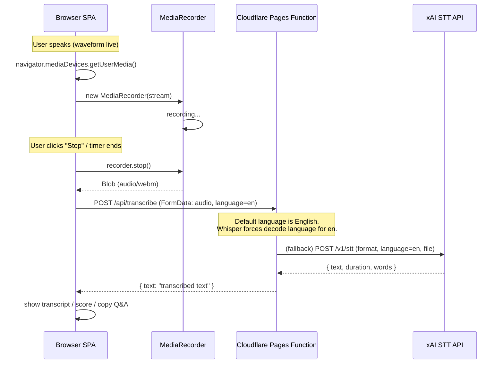

# Speech Recognition System

Records audio from the browser microphone using `MediaRecorder`, then sends it to a Cloudflare Pages Function that transcribes via **xAI Speech-to-Text** (`POST https://api.x.ai/v1/stt`). Falls back to Workers AI Whisper if `XAI_API_KEY` is not set. Used by **Listen and Repeat** and **Take an Interview**.

## Architecture


```mermaid
sequenceDiagram
    participant Browser as Browser SPA
    participant MR as MediaRecorder
    participant CF as Cloudflare Pages Function
    participant XAI as xAI STT API

    Note over Browser: User speaks (waveform live)
    Browser->>Browser: navigator.mediaDevices.getUserMedia()
    Browser->>MR: new MediaRecorder(stream)
    MR->>MR: recording...
    Note over Browser: User clicks "Stop" / timer ends
    Browser->>MR: recorder.stop()
    MR-->>Browser: Blob (audio/webm)
    Browser->>CF: POST /api/transcribe (FormData: audio, language=en)
    Note over CF: Default language is English.<br/>Whisper forces decode language for en.
    CF->>XAI: (fallback) POST /v1/stt (format, language=en, file)
    XAI-->>CF: { text, duration, words }
    CF-->>Browser: { text: "transcribed text" }
    Browser->>Browser: show transcript / score / copy Q&A
```

## Key abstractions

**Hook** (`src/hooks/useSpeechRecognition.ts`):

| Property/Method     | Description                                                |
| ------------------- | ---------------------------------------------------------- |
| `supported`         | Boolean — browser has `MediaRecorder` + `getUserMedia`     |
| `recording`         | Boolean — true while microphone is active                  |
| `processing`        | Boolean — true while transcription is in flight after stop |
| `transcript`        | String — latest transcription result                       |
| `levels`            | `number[]` (0–1) — live frequency bars for `MicWaveform`   |
| `error`             | String or null — error message                             |
| `start()`           | Request mic access, start level meter, begin recording     |
| `stop()`            | Stop recording; resolves with transcribed text after STT   |
| `clearTranscript()` | Reset transcript                                           |
| `clearError()`      | Clear error                                                |

**UI** (`src/components/ui/MicWaveform.tsx`):

Live bar visualization driven by `levels` so the user can confirm the mic works.

**API client** (`src/lib/transcribe.ts`):

| Function                              | Description                                                        |
| ------------------------------------- | ------------------------------------------------------------------ |
| `transcribeAudio(blob, url, signal?)` | POST audio Blob to transcription endpoint, return transcribed text |

**Cloudflare Pages Function** (`functions/api/transcribe.ts`):

| Handler            | Description                                                                                            |
| ------------------ | ------------------------------------------------------------------------------------------------------ |
| `onRequestPost`    | Validates audio (max 25 MB), calls xAI STT when `XAI_API_KEY` is set; else Workers AI Whisper fallback |
| `onRequestOptions` | Returns CORS preflight headers                                                                         |

## Configuration

| Env / secret  | Where                                 | Purpose                      |
| ------------- | ------------------------------------- | ---------------------------- |
| `XAI_API_KEY` | Cloudflare Pages secret / `.dev.vars` | Preferred STT provider (xAI) |
| `AI` binding  | `wrangler.jsonc`                      | Optional Whisper fallback    |

Local development:

```bash
# .dev.vars (gitignored)
XAI_API_KEY=xai-...

npm run dev   # Vite + wrangler pages dev; /api/transcribe is proxied
```

Production:

```bash
npx wrangler pages secret put XAI_API_KEY
```

## How it works

### Browser recording

1. Browser support is checked: `navigator.mediaDevices.getUserMedia` and `MediaRecorder` must exist.
2. A suitable MIME type is selected from candidates: `audio/webm;codecs=opus`, `audio/webm`, `audio/mp4`, `audio/mp4;codecs=mp4a.40.2`.
3. `getUserMedia({ audio: { echoCancellation, noiseSuppression } })` opens the microphone.
4. An `AnalyserNode` samples frequency data into `levels` for the waveform UI.
5. A `MediaRecorder` captures chunks via `dataavailable` events (timeslice 250ms).
6. On `stop`, chunks are assembled into a `Blob` and sent to `/api/transcribe`.

### Transcription API (xAI)

1. The function builds multipart form data: `format=true`, `language=en`, then `file` **last** (xAI requirement).
2. `POST https://api.x.ai/v1/stt` with `Authorization: Bearer $XAI_API_KEY`.
3. Response `{ text, language?, duration? }` is returned to the client as JSON.

### Take an Interview copy helper

`buildInterviewQaCopyMessage()` in `answerSubmission.ts` formats question + transcribed answer (+ sample answer / criteria) for pasting into an external LLM chat. No in-app chat is implemented.

### Error handling

- Microphone permission denied, device not found, or generic `DOMException` produce user-facing messages.
- Transcription failures surface the API error message when available.
- Empty audio recordings produce `"No audio recorded. Please try again."`.
- `AbortController` prevents stale transcription callbacks if recording is restarted.
